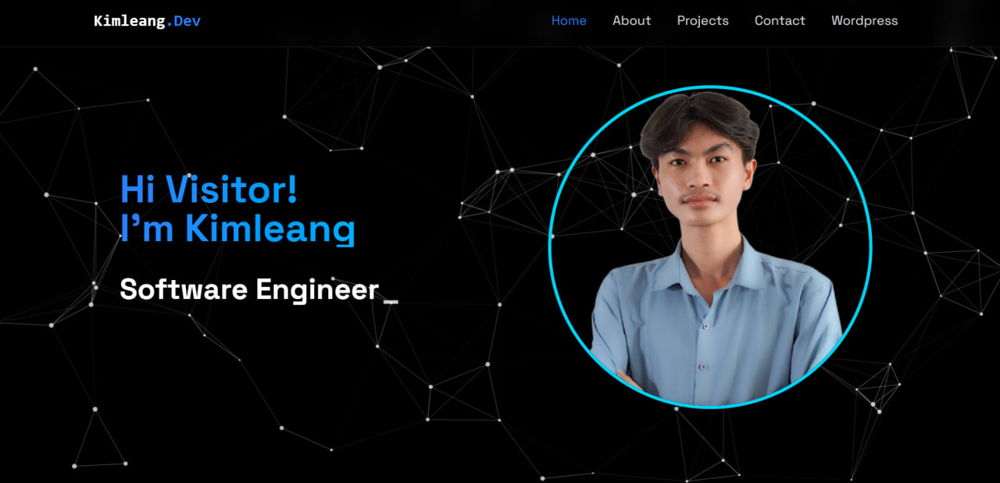

# 🌟 Portfolio - React.js + Vite + Tailwind CSS

This is my personal portfolio! This project is built with **React**, **Vite**, and **Tailwind CSS** to showcase my skills, projects, and experience. It is fully responsive, fast, and customizable for anyone looking to use it as a template. 🚀



## 🔗Demo

Check out the live version here: [My Portfolio](https://www.kimleang.site) (Deployed on **Vercel**)

## 📂 Features

- ⚡ **Vite-Powered**: Super fast development and optimized builds
- 🎨 **Tailwind CSS**: Beautiful and responsive design
- 🌙 **Dark Mode Support**
- 🔧 **Easily Customizable**: Change content, colors, and layout quickly
- 📱 **Fully Responsive**: Works on all devices

## 🚀 Getting Started

### 1️⃣ Clone this repository:

```bash
git clone https://github.com/kimmleang/react-portfolio-template.git
cd react-portfolio-template
```

### 2️⃣ Install dependencies:

```bash
npm install  # or yarn install
```

### 3️⃣ Run the development server:

```bash
npm run dev  # or yarn dev
```

### 4️⃣ Build for production:

```bash
npm run build  # or yarn build
```

## 🌍 Deployment

This project is already deployed on **Vercel**, but you can deploy it to other platforms like Netlify, GitHub Pages, or your own hosting.

### Deploy on Vercel (Recommended)

1. Push your code to GitHub
2. Go to [Vercel](https://vercel.com/) and import your repository
3. Set up the build command: `npm run build`
4. Deploy and connect your custom domain!

## 📜 License

This project is **open-source** and available under the [MIT License](LICENSE).

## 🤝 Contributing

Feel free to **fork** this repository and modify it as per your needs. If you improve something, consider submitting a pull request! 

If you like this project, don't forget to **star** the repo and **fork** it for your use! 
